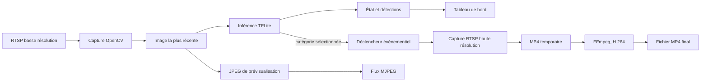

# Architecture de z-cam-surveillance

> Documentation de l’implémentation observée en version 0.0.5.
> L’application exécute l’analyse et le serveur vidéo sur le même hôte.

## 1. Mission et limites

z-cam-surveillance est une application Flask locale de surveillance vidéo.
Elle lit deux flux RTSP indépendants :

- le flux basse résolution sert à l’analyse continue ;
- le flux haute résolution sert aux enregistrements
  d’événements.

Un modèle SSD MobileNet V2 entraîné sur COCO détecte les catégories
activées.
Une interface web affiche l’aperçu, les détections, la configuration et les
fichiers MP4. Les vidéos restent dans le dossier local configuré.

Le traitement n’appelle aucun service cloud. En revanche, le serveur web ne
fournit pas d’authentification : son accès doit rester sur un réseau de
confiance.

## 2. Vue d’ensemble



L’interface web et le moteur de surveillance partagent le même processus
Python. Les données du moteur sont synchronisées par un verrou ; les boucles
de capture et d’analyse ne bloquent pas les routes Flask.

## 3. Démarrage et cycle de vie

### Démarrage normal

`./start.sh` est le point d’entrée prévu :

1. Le script traite les options d’information comme `--help` et `--version`.
2. Il recherche dans `/proc` une instance utilisant ce projet et ce fichier de
   configuration.
3. S’il en trouve une, il lui envoie `SIGTERM`, attend jusqu’à 30 secondes,
   puis emploie `SIGKILL` si nécessaire.
4. Il démarre `surveillance.py` avec l’interpréteur de `.venv` et le JSON
   local.

Un enregistrement depuis Configuration suit aussi ce cycle : le JSON est
validé et écrit, puis `start.sh` est lancé après un court délai.
La nouvelle instance expose un identifiant différent, que le navigateur
attend avant de recharger la page.

### Initialisation du moteur

`surveillance.py` charge le JSON, valide les paramètres et construit le
moteur ainsi que le détecteur TFLite. Le chargement de l’interpréteur essaie
dans l’ordre `ai_edge_litert`, `tflite_runtime`, puis TensorFlow.
L’application web est créée par `create_app(engine)` dans
`surveillance_web.py`.

L’arrêt normal signale les boucles de capture, attend leur fin et finalise
les enregistrements en cours. Le script de démarrage envoie les signaux au
processus identifié ; il ne tue pas arbitrairement les autres processus
Python.

## 4. Organisation du dépôt

```text
surveillance.py                 moteur, modèle TFLite et CLI
surveillance_config.py          schéma, validation et persistance JSON
surveillance_web.py             application Flask et API
surveillance_recordings.py       recherche, détails et résolution des clips
surveillance_media.py            conversion H.264 atomique
transcode_recordings.py          migration des anciens clips
start.sh                        arrêt et démarrage de l’application
app_version.py                  version manuelle de l’application
models/                         modèle SSD et labels COCO
static/                          JavaScript et CSS de l’interface
templates/                       pages Jinja en français
tests/                            tests unitaires et de routes
captures/                         destination par défaut des enregistrements
screenshots/                      captures de documentation et de tests
```

`tst_RTSP_flux.py` est un ancien outil de diagnostic des chemins RTSP.
Il sert Flask sur le port 8090 et n’est pas dans le cycle normal de
l’application, qui utilise le port 8091.

## 5. Détection d’objets

### Entrées et résultats

`TFLiteDetector.detect(self, frame: np.ndarray) -> list[Detection]`
prépare une image BGR reçue d’OpenCV : redimensionnement à la taille
attendue par le modèle, conversion BGR vers RGB, puis invocation TFLite. Les
sorties SSD fournissent les boîtes, les classes, les scores et leur nombre.

Le détecteur applique le seuil de confiance et filtre les classes avec
`enabled_labels`. La correspondance COCO utilise les identifiants du modèle
à base zéro. Les boîtes sont normalisées pour permettre leur affichage dans
le navigateur quelle que soit la résolution du flux.

Le modèle livré est
`models/ssd_mobilenet_v2_coco_quant_postprocess.tflite`.
Le fichier `models/coco_labels.txt` contient 90 lignes, dont des entrées
`n/a` ; 80 catégories utilisables sont proposées dans Configuration. Les
six catégories activées par défaut sont : personne, voiture, vélo, moto,
chien et chat.

### Boucles concurrentes

`Surveillance` lance trois travailleurs :

1. **Capture basse résolution** : maintient une connexion RTSP et publie la
   dernière image disponible.
2. **Inférence** : analyse à la cadence configurée, met à jour l’état,
   encode l’image d’aperçu en JPEG et actualise les détections.
3. **Capture haute résolution** : reste inactive jusqu’à un événement,
   puis écrit les images du clip.

Les pertes de flux déclenchent des tentatives de reconnexion avec temporisation
progressive, bornée entre 1 et 30 secondes. La cadence d’analyse est
configurable indépendamment de la fréquence d’acquisition.

## 6. Enregistrement des événements

Une détection appartenant à une classe activée demande un enregistrement si
la fonction est activée. Le flux haute résolution n’est ouvert qu’à ce
moment-là. Le clip continue tant qu’il y a des détections ; après la
dernière, `no_detection_seconds` détermine le délai avant fermeture.

La planification des images utilise d’abord l’horodatage RTSP
`CAP_PROP_POS_MSEC`. Si cette horloge est absente ou incohérente, le moteur
utilise une horloge monotone. Il calcule les instants de sortie et répète la
dernière image lorsque nécessaire pour conserver la cadence sans accélérer
artificiellement la durée du clip. Un clip sans image est supprimé.

OpenCV écrit d’abord un fichier temporaire en `mp4v`. À la fermeture, un
travailleur distinct demande à FFmpeg une conversion H.264 en `yuv420p`.
Le fichier converti est publié par remplacement atomique. En cas d’échec,
la source temporaire est préservée et publiée comme solution de repli ; elle
peut être moins compatible avec les navigateurs.

Les fichiers sont nommés avec la date et l’heure, puis placés dans le
dossier configuré, `captures/` par défaut.

## 7. Configuration et persistance

`surveillance_config.py` porte les valeurs par défaut et valide le contenu de
`surveillance.config.json` (exemple : `surveillance.config.example.json`).
Les 12 paramètres sont :

| Paramètre | Rôle |
| --- | --- |
| `low_resolution_url` | URL RTSP du flux d’analyse |
| `high_resolution_url` | URL RTSP du flux d’enregistrement |
| `threshold` | confiance minimale, 0,5 par défaut |
| `interval` | intervalle d’analyse, 0,5 s par défaut |
| `no_detection_seconds` | délai de fermeture, 10 s par défaut |
| `recording_enabled` | active ou désactive les clips événementiels |
| `enabled_labels` | catégories COCO que le détecteur conserve |
| `output_dir` | dossier de destination, `captures` par défaut |
| `model` | chemin du modèle TFLite |
| `labels` | chemin du fichier de labels |
| `host` | adresse d’écoute, `0.0.0.0` par défaut |
| `port` | port HTTP, 8091 par défaut |

La validation rejette les types et valeurs non pris en charge, les URLs qui ne
sont pas `rtsp://` ou `rtsps://`, et les labels inconnus. Le JSON est écrit
atomiquement via un fichier temporaire, synchronisé, puis remplacé. Le
fichier reçoit les permissions `0600`.

Les URLs comportent souvent un nom d’utilisateur et un mot de passe. Elles
sont stockées en clair dans le JSON local, ignoré par Git et protégé par les
permissions du système. Le serveur ne les renvoie pas dans `/api/config` ni
`/api/state`. Seule l’action explicite de révélation renvoie l’URL
demandée.
Ne copiez jamais le JSON local dans une documentation, un artefact ou une
capture d’écran.

## 8. Interface web et API

Les pages Jinja partagent `base.html`, la navigation et le thème CSS :

- `/` : état du moteur, aperçu MJPEG et détections de la dernière image ;
- `/configuration` : sources, seuil, cadence, délai, modèles et classes ;
- `/recordings` : bibliothèque, lecteur MP4, navigation et métadonnées ;
- `/help` : explication des réglages et du fonctionnement ;
- `/about` : version et informations sur le traitement local.

`static/dashboard.js` interroge `/api/state` chaque seconde. Il dessine les
boîtes normalisées dans un SVG superposé à l’image. `/video_feed` transmet
l’aperçu sous forme de multipart MJPEG.

| Route | Fonction |
| --- | --- |
| `GET /api/config` | réglages sans les URLs RTSP |
| `POST /api/config` | valide, sauvegarde et redémarre si nécessaire |
| `POST /api/config/reveal` | révèle une seule URL sur demande explicite |
| `GET /api/state` | état, détections, PID et identifiant d’instance |
| `GET /api/recordings` | recherche et pagination des MP4 |
| `GET /api/recordings/<nom>` | métadonnées du fichier sélectionné |
| `GET /api/recordings/<nom>/video` | MP4 et plages HTTP |
| `DELETE /api/recordings/<nom>` | suppression du clip sélectionné |
| `GET /video_feed` | flux MJPEG de l’aperçu courant |

La bibliothèque recherche dans les noms et dates, ignore les liens
symboliques et ne résout que des fichiers MP4 directement présents dans le
dossier configuré. Elle trie les clips du plus récent au plus ancien et
renvoie 40 éléments par page. Les métadonnées vidéo sont obtenues avec
`ffprobe`.

L’interface propose la recherche en temps réel, les vitesses 1×, 1,5× et
2×, les commandes précédent/suivant, les raccourcis clavier et une
confirmation avant suppression. Sur mobile, la liste et le lecteur
s’empilent.

## 9. Sécurité et confidentialité

Le traitement est local, mais le serveur écoute par défaut sur toutes les
interfaces réseau (`0.0.0.0`). Aucune connexion ni session utilisateur
n’est requise. Réservez l’accès à un LAN de confiance ou ajoutez un
contrôle d’accès au niveau réseau ; ne publiez pas directement le port sur
Internet.

Les réponses désactivent le cache et ajoutent `nosniff` et `no-referrer`.
Les actions de révélation et de suppression exigent un en-tête de requête
personnalisé. Cela réduit les appels involontaires depuis un formulaire
inter-sites, mais ne remplace pas l’authentification.

`captures/`, le JSON local, `.runtime/` et l’environnement virtuel sont des
données locales, pas des sources à committer. Les journaux de redémarrage
sont conservés dans `.runtime/surveillance.log` avec des permissions
restreintes.

## 10. Outils de conversion et compatibilité

Les anciens clips peuvent être audités sans modification :

```bash
.venv/bin/python transcode_recordings.py --directory captures
```

L’ajout de `--apply` réalise la migration. Les sources sont archivées sous
`.originals/`, les clips convertis remplacent les fichiers de manière
atomique et l’outil garde une réserve minimale de 512 Mio sur le disque.

`surveillance_media.py` est aussi utilisé à la fin des nouveaux événements.
La conversion dépend de FFmpeg avec l’encodeur `libx264` et de `ffprobe` pour
les contrôles de métadonnées.

## 11. Installation, exploitation et tests

Le projet vise Linux x86_64 et aarch64 avec Python 3.10 ou plus récent.
`ai-edge-litert` fournit les roues utilisées sur Raspberry Pi 64 bits ;
ARMv7 32 bits n’est pas pris en charge par cette dépendance. FFmpeg et
`ffprobe` doivent être installés pour la compatibilité H.264.

Après création de `.venv` et installation de `requirements.txt`,
démarrez l’application avec :

```bash
./start.sh
```

Le port par défaut est 8091. L’interface contient les pages de configuration
et d’aide ; évitez de démarrer une deuxième instance manuellement.
La suite de tests se lance avec :

```bash
.venv/bin/python -m unittest discover -s tests -v
```

Les tests couvrent notamment la validation et la migration du JSON, la
protection des URLs, le filtrage TFLite, la cadence à partir des horodatages
RTSP, la conversion H.264, les plages HTTP des vidéos, la pagination, la
suppression sûre et l’archivage des originaux.

## 12. Captures de démonstration

Les captures montrent l’interface 0.0.5 avec des données
entièrement synthétiques. La scène et les clips sont générés pour la
documentation. Aucun flux réel ni identifiant RTSP n’a été utilisé.

- `screenshots/261004.125937-architecture-dashboard.png`
- `screenshots/261004.125937-architecture-configuration.png`
- `screenshots/261004.125937-architecture-recordings-desktop.png`
- `screenshots/261004.125937-architecture-recordings-mobile.png`
- `screenshots/261004.125937-architecture-about.png`

## 13. Fichiers de référence

- `README.md` : installation et prise en main ;
- `PROMPT.md` et les prompts spécialisés : exigences produit ;
- `requirements.txt` : dépendances Python ;
- `surveillance.config.example.json` : exemple sans URL ni secret ;
- `tests/` : tests exécutables de l’implémentation.
